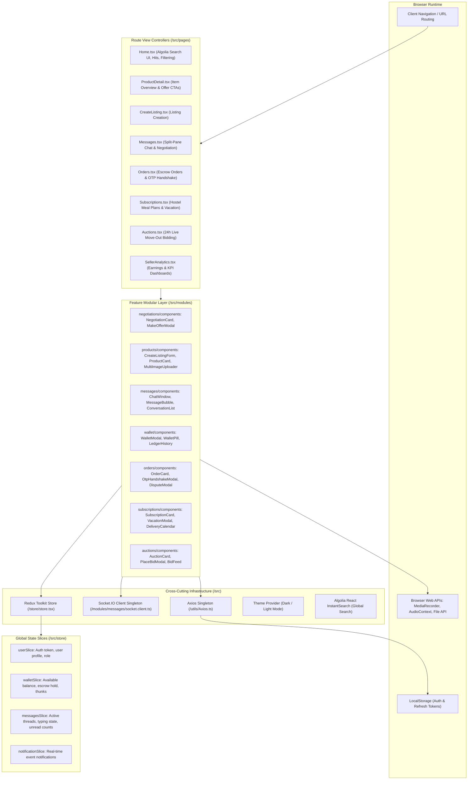
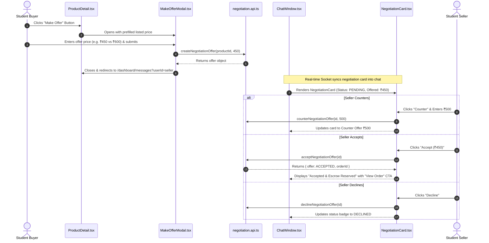
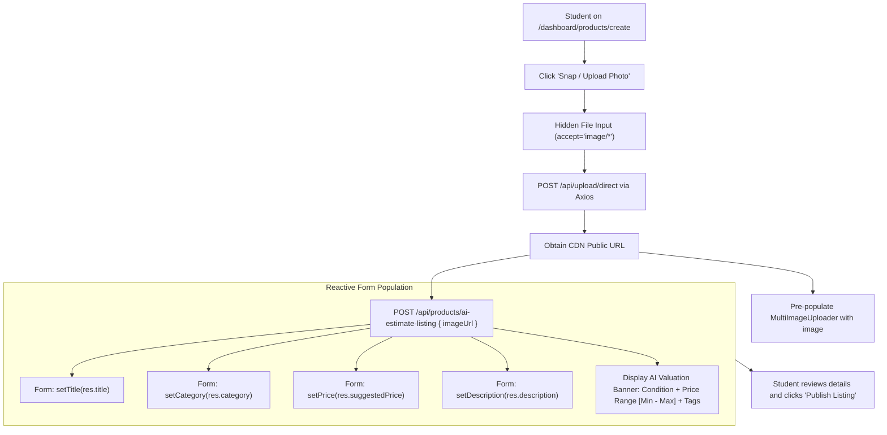
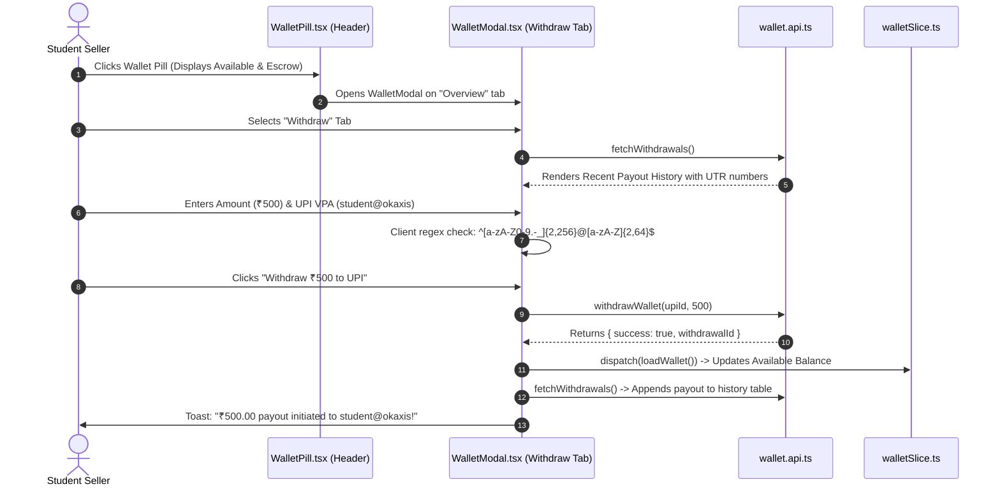
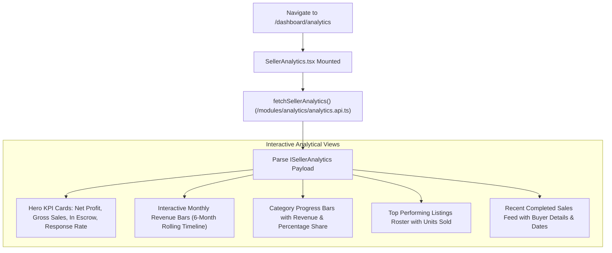

# College Marketplace — Frontend Architecture & Component Specification

> **Live Application**: [http://college-market-place-frontend.vercel.app/](http://college-market-place-frontend.vercel.app/)  
> **Framework**: React 19 (TypeScript) with Vite  
> **State & Networking**: Redux Toolkit, Axios Interceptors, Socket.IO Client  
> **UI & Styling**: Tailwind CSS, Radix UI Primitives, Lucide Icons, Framer Motion  
> **Deployment**: Vercel SPA with Client-Side Route Rewrites

---

## 1. High-Level Frontend Architecture

The frontend follows a **feature-first modular architecture**. All domain logic, API clients, TypeScript definitions, and UI components are encapsulated under `src/modules/<feature>/`, while `src/pages/` orchestrates modular components into full-screen views.



---

## 2. Comprehensive Directory Structure & Modular Breakdown

```
Frontend/
├── index.html                            # HTML5 SPA entry with canonical link to vercel.app
├── vercel.json                           # Vercel SPA routing rewrites to /index.html
├── package.json                          # Dependencies, homepage URL, build scripts
├── tsconfig.json                         # TypeScript configuration
├── vite.config.ts                        # Vite build configuration and path aliases
├── src/
│   ├── main.tsx                          # React DOM root mounting Provider & Router
│   ├── App.tsx                           # Core App wrapper & theme initialization
│   ├── vite-env.d.ts                     # Vite client environment types
│   ├── index.css                         # Tailwind CSS base, components & utility directives
│   ├── config/
│   │   └── site.ts                       # Global site metadata & live Vercel app URL
│   ├── router/
│   │   └── index.tsx                     # React Router v7 route tree with ProtectedRoute
│   ├── store/                            # Redux Toolkit global state store
│   │   ├── store.tsx                     # configureStore combining all domain reducers
│   │   ├── userSlice.ts                  # User credentials, college verification & profile
│   │   ├── walletSlice.ts                # Wallet balance, escrow hold & loadWallet thunk
│   │   ├── messagesSlice.ts              # Active conversation threads, typing state & unread
│   │   └── notificationSlice.ts          # Real-time event notifications banner store
│   ├── lib/
│   │   └── utils.ts                      # clsx and tailwind-merge helper function (`cn`)
│   ├── utils/
│   │   ├── Axios.ts                      # Centralized Axios client with JWT interceptors
│   │   ├── mode.toggle.tsx               # Theme switcher toggle component
│   │   └── theme-provider.tsx            # Context provider for dark/light theme switching
│   ├── hooks/
│   │   └── useFetchUser.ts               # Custom hook for active student session polling
│   ├── services/
│   │   └── api.ts                        # Legacy API wrapper services
│   ├── components/                       # Shared global components & UI primitives
│   │   ├── Header.tsx                    # Shared platform header
│   │   ├── Footer.tsx                    # Campus marketplace footer
│   │   ├── Sidebar.tsx                   # Side navigation with badge counters
│   │   ├── ProtectedRoute.tsx            # Authentication route barrier
│   │   ├── ProductCard.tsx               # Reusable product card component
│   │   ├── auth/                         # Student auth modal & forms
│   │   │   ├── LoginForm.tsx
│   │   │   ├── SignUp.tsx
│   │   │   ├── OtpInput.tsx
│   │   │   ├── VerifyEmail.tsx
│   │   │   ├── ForgotPassword.tsx
│   │   │   ├── ResetOtp.tsx
│   │   │   ├── ResetPassword.tsx
│   │   │   └── Thankyou.tsx
│   │   ├── landing/                      # Landing page presentation blocks
│   │   │   ├── HeroSection.tsx
│   │   │   ├── CategoryShowcase.tsx
│   │   │   ├── FeatureSection.tsx
│   │   │   ├── HowItWorksSection.tsx
│   │   │   ├── StatsBanner.tsx
│   │   │   ├── SafetySection.tsx
│   │   │   ├── TestimonialsSection.tsx
│   │   │   ├── FAQSection.tsx
│   │   │   └── CTASection.tsx
│   │   ├── layout/                       # Structured dashboard layout templates
│   │   │   ├── DashboardLayout.tsx
│   │   │   ├── Header.tsx
│   │   │   └── Sidebar.tsx
│   │   └── ui/                           # Radix UI design system primitives
│   │       ├── accordion.tsx
│   │       ├── avatar.tsx
│   │       ├── badge.tsx
│   │       ├── button.tsx
│   │       ├── card.tsx
│   │       ├── carousel.tsx
│   │       ├── dialog.tsx
│   │       ├── dropdown-menu.tsx
│   │       ├── ImageUploader.tsx
│   │       ├── input.tsx
│   │       ├── label.tsx
│   │       ├── MultiImageUploader.tsx
│   │       ├── select.tsx
│   │       ├── tabs.tsx
│   │       ├── textarea.tsx
│   │       └── toast.tsx
│   ├── modules/                          # Feature modules (API, TypeScript types, UI)
│   │   ├── admin/                        # Superadmin control panel
│   │   │   ├── admin.api.ts
│   │   │   ├── admin.types.ts
│   │   │   └── components/
│   │   ├── analytics/                    # Seller revenue & sales analytics
│   │   │   ├── analytics.api.ts
│   │   │   └── analytics.types.ts
│   │   ├── assistant/                    # AI campus assistant chatbot
│   │   │   ├── assistant.api.ts
│   │   │   └── components/
│   │   ├── auctions/                     # 24-hour move-out live auctions
│   │   │   ├── auction.api.ts
│   │   │   ├── auction.types.ts
│   │   │   └── components/
│   │   ├── messages/                     # Socket.IO chat, voice notes & media
│   │   │   ├── message.api.ts
│   │   │   ├── message.types.ts
│   │   │   ├── socket.client.ts
│   │   │   └── components/
│   │   ├── negotiations/                 # In-chat bargaining cards & MakeOfferModal
│   │   │   ├── negotiation.api.ts
│   │   │   ├── negotiation.types.ts
│   │   │   └── components/
│   │   ├── notifications/                # Real-time notifications dropdown & bell
│   │   │   ├── notification.types.ts
│   │   │   └── components/
│   │   ├── orders/                       # Escrow purchase, rental & OTP handshake
│   │   │   ├── order.api.ts
│   │   │   ├── order.types.ts
│   │   │   └── components/
│   │   ├── products/                     # Product catalog, types & AI auto-fill
│   │   │   ├── product.api.ts
│   │   │   ├── product.types.ts
│   │   │   └── components/
│   │   ├── reviews/                      # User & service reviews
│   │   │   ├── review.api.ts
│   │   │   ├── review.types.ts
│   │   │   └── components/
│   │   ├── subscriptions/                # Recurring meal/laundry subscriptions & vacation pause
│   │   │   ├── subscription.api.ts
│   │   │   ├── subscription.types.ts
│   │   │   └── components/
│   │   ├── upload/                       # Media upload API client
│   │   │   └── upload.api.ts
│   │   ├── wallet/                       # Wallet balance, UPI payout modal & ledger
│   │   │   ├── wallet.api.ts
│   │   │   ├── wallet.types.ts
│   │   │   └── components/
│   │   └── wanted/                       # Campus "Wanted" bulletin board
│   │       ├── wanted.api.ts
│   │       ├── wanted.types.ts
│   │       └── components/
│   └── pages/                            # Full-page routes
│       ├── LandingPage.tsx
│       ├── Home.tsx
│       ├── Products.tsx
│       ├── ProductDetail.tsx
│       ├── CreateListing.tsx
│       ├── EditListing.tsx
│       ├── Messages.tsx
│       ├── Orders.tsx
│       ├── Subscriptions.tsx
│       ├── Auctions.tsx
│       ├── SellerAnalytics.tsx
│       ├── WantedBoard.tsx
│       ├── Profile.tsx
│       ├── AdminDashboard.tsx
│       ├── auth.tsx
│       ├── layout.tsx
│       └── DashboardLayout.tsx
```

---

## 3. Frontend Component & Flow Architectures

### 3.1 Direct Negotiation & Counter-Offers Flow



---

### 3.2 AI Visual Listing Creator Flow



---

### 3.3 In-Chat Media & Voice Notes Engine

```mermaid
flowchart TD
    subgraph ChatInputBar["ChatWindow Footer Controls"]
        PhotoBtn["Camera Button"] --> PickImage["File Picker (accept='image/*')"]
        MicBtn["Mic Button"] --> Stream["navigator.mediaDevices.getUserMedia({ audio: true })"]
    end

    PickImage --> ValidateImg{"File.type starts with 'image/'?"}
    ValidateImg -->|Yes| UploadImg["uploadChatMediaApi(file)"]
    ValidateImg -->|No (e.g. video/*)| ToastError["toast.error('Only photos & voice notes allowed')"]

    Stream --> Recorder["MediaRecorder(stream) starts recording"]
    Recorder --> Timer["Active Recording UI: Red Pulse + Timer (0:00 / 2:00)"]
    Timer --> StopAction{"Student Action"}
    StopAction -->|Cancel / Trash| Discard["Stop stream & clear audio chunks"]
    StopAction -->|Done & Send| GenBlob["Generate audio/webm Blob"]
    GenBlob --> UploadAudio["uploadChatMediaApi(blob)"]

    UploadImg --> EmitSocketMsg["socket.emit('send_message', { mediaType: 'IMAGE', mediaUrl })"]
    UploadAudio --> EmitSocketVoice["socket.emit('send_message', { mediaType: 'AUDIO', mediaUrl, audioDuration })"]

    subgraph MessageRendering["MessageBubble.tsx"]
        EmitSocketMsg --> ImgBubble["Render Image Thumbnail with Lightbox Click"]
        EmitSocketVoice --> AudioBubble["Render Voice Note Player: Play/Pause + Interactive Waveform + Duration"]
    end
```

---

### 3.4 Real UPI Withdrawals & Wallet Modal Flow



---

### 3.5 Seller Analytics & Financial Intelligence Dashboard



---

## 4. State Management Topology

The frontend uses **Redux Toolkit** for predictable state updates across disparate components:

| Redux Slice | Primary State Keys | Key Actions / Thunks | Subscribed Components |
|---|---|---|---|
| `walletSlice` | `balance`, `escrowBalance`, `loading` | `loadWallet()` (async thunk) | `WalletPill`, `WalletModal`, `ProductDetail`, `Orders` |
| `messagesSlice` | `conversations`, `activeMessages`, `unreadTotal`, `typingUsers` | `setConversations`, `appendMessage`, `setUserTyping` | `Messages`, `ChatWindow`, `ConversationList`, `Sidebar` |
| `userSlice` | `id`, `name`, `email`, `college`, `role` | `setUser`, `clearUser` | `Header`, `Sidebar`, `ProtectedRoute`, `ProductDetail` |
| `notificationSlice` | `notifications`, `unreadCount` | `addNotification`, `markAsRead` | `NotificationBell`, `NotificationDropdown` |

---

## 5. Deployment & Vercel Configuration

The frontend is deployed to Vercel at [http://college-market-place-frontend.vercel.app/](http://college-market-place-frontend.vercel.app/). All HTML5 PushState routes are routed to `/index.html` via `Frontend/vercel.json`:

```json
{
  "rewrites": [
    {
      "source": "/(.*)",
      "destination": "/index.html"
    }
  ]
}
```
